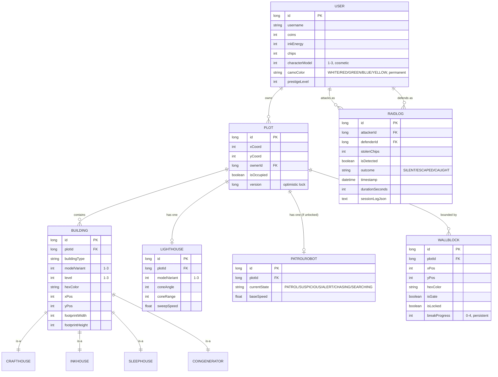

# ER Diagram v2 — Shadow Palette: Stealth & Siege

## Notes
- `Building` uses JPA `@Inheritance(strategy = JOINED)` for `CraftHouse`, `InkHouse`, `SleepHouse`, `CoinGenerator` — gives the `BuildingFactory` real polymorphic output.
- `Lighthouse` and `PatrolRobot` are separate tables (not `Building` subclasses) since they're defense-specific with a hard 1-per-plot constraint — enforce via a unique constraint on `plotId`.
- `WallBlock.isGate` marks the single entry gate; `isLocked` flips true when an alarm triggers; `breakProgress` persists across interruptions (never resets).
- `Plot.version` is a `@Version` field for optimistic locking on plot purchase races.
- `RaidLog.sessionLogJson` stores enough replay data (tick-by-tick position + color state) for server-side outcome validation.
