# UML Class Diagram v2 — Design Patterns

```mermaid
classDiagram
    %% STATE PATTERN — Game Phase
    class GameState {
        <<interface>>
        +handle(GameContext)
    }
    class BuildState
    class RaidState
    class EscapeState
    GameState <|.. BuildState
    GameState <|.. RaidState
    GameState <|.. EscapeState
    class GameContext {
        -GameState currentState
        +setState(GameState)
    }
    GameContext --> GameState

    %% STATE PATTERN — Guard AI (extended)
    class GuardState {
        <<interface>>
        +update(PatrolRobot)
    }
    class PatrolState
    class SuspiciousState
    class AlertState
    class ChasingState
    class SearchingState
    GuardState <|.. PatrolState
    GuardState <|.. SuspiciousState
    GuardState <|.. AlertState
    GuardState <|.. ChasingState
    GuardState <|.. SearchingState
    class PatrolRobot {
        -GuardState currentState
        -float baseSpeed
        +setState(GuardState)
    }
    PatrolRobot --> GuardState

    %% FACTORY PATTERN — two factories
    class BuildingFactory {
        +createBuilding(type) Building
    }
    class Building {
        <<abstract>>
        #level int
        #hexColor String
    }
    class CraftHouse
    class InkHouse
    class SleepHouse
    class CoinGenerator
    Building <|-- CraftHouse
    Building <|-- InkHouse
    Building <|-- SleepHouse
    Building <|-- CoinGenerator
    BuildingFactory ..> Building : creates

    class DefenseFactory {
        +createDefense(type) Object
    }
    class Lighthouse
    class PatrolRobot
    DefenseFactory ..> Lighthouse : creates
    DefenseFactory ..> PatrolRobot : creates

    %% STRATEGY PATTERN — 5 colors, assigned once
    class CamouflageStrategy {
        <<interface>>
        +getShade() Shade
        +matchesSurrounding(Shade) boolean
    }
    class WhiteStrategy
    class RedStrategy
    class GreenStrategy
    class BlueStrategy
    class YellowStrategy
    CamouflageStrategy <|.. WhiteStrategy
    CamouflageStrategy <|.. RedStrategy
    CamouflageStrategy <|.. GreenStrategy
    CamouflageStrategy <|.. BlueStrategy
    CamouflageStrategy <|.. YellowStrategy
    class Player {
        -CamouflageStrategy camoStrategy
        note "assigned once at setup, not swapped"
    }
    Player --> CamouflageStrategy

    %% OBSERVER PATTERN
    class Subject {
        <<interface>>
        +attach(Observer)
        +notifyObservers()
    }
    class SensorSubject
    Subject <|.. SensorSubject
    class Observer {
        <<interface>>
        +update()
    }
    class Siren
    class AlertLight
    class GateLock
    class PatrolRobotAlertListener
    Observer <|.. Siren
    Observer <|.. AlertLight
    Observer <|.. GateLock
    Observer <|.. PatrolRobotAlertListener
    SensorSubject --> Observer

    %% SINGLETON
    class GameSessionManager {
        <<singleton>>
        -static instance
        +getInstance() GameSessionManager
    }

    %% BUILDER
    class RaidSessionBuilder {
        +setAttacker(User)
        +setDefenderSnapshot(Layout)
        +setConfig(RaidConfig)
        +build() RaidSession
    }
    class RaidSession
    RaidSessionBuilder ..> RaidSession : builds

    %% OPTIONAL: COMMAND (wall break)
    class WallBreakCommand {
        <<interface>>
        +execute(WallBlock)
    }
    class HitCommand
    WallBreakCommand <|.. HitCommand
```



## Notes
- `SensorSubject.notifyObservers()` now fires **four** observers simultaneously on detection: `Siren`, `AlertLight`, `GateLock` (locks the single gate), and `PatrolRobotAlertListener` (flips the robot's state to `ChasingState`) — one Observer trigger driving the whole escape-phase cascade.
- `GuardState` now has 5 concrete states instead of 3, giving the State pattern more visible depth for the report/demo: `Patrol → Suspicious → Alert → Chasing → Searching → (back to) Patrol`.
- `WallBreakCommand`/`HitCommand` is optional — include it only if you want a 7th pattern; it cleanly models "each hit is an interruptible action whose effect persists," matching the confirmed no-decay wall-break design.

## Suggested package structure
```
com.shadowpalette
├── state.game         (GameContext, BuildState, RaidState, EscapeState)
├── state.guard         (PatrolRobot, PatrolState, SuspiciousState, AlertState, ChasingState, SearchingState)
├── factory             (BuildingFactory, DefenseFactory, Building + subclasses, Lighthouse)
├── strategy             (CamouflageStrategy, WhiteStrategy, RedStrategy, GreenStrategy, BlueStrategy, YellowStrategy)
├── observer             (Subject, SensorSubject, Observer, Siren, AlertLight, GateLock, PatrolRobotAlertListener)
├── session             (GameSessionManager, RaidSessionBuilder, RaidSession)
├── command (optional)   (WallBreakCommand, HitCommand)
├── entity               (User, Plot, Building subclasses, WallBlock, RaidLog — JPA entities)
└── controller           (REST endpoints)
```
